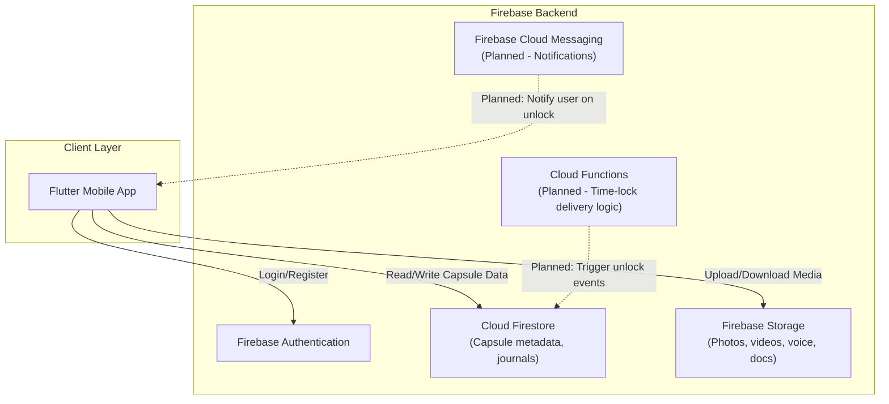

<div align="center">


<!-- Project Logo Placeholder -->


### 🕰️ A secure digital memory platform for preserving what matters — and delivering it exactly when it should arrive.

[](#-current-status)
[](#-technology-stack)
[](#-technology-stack)
[](#-license)
[](#-contributing)

</div>

---

## 📖 Project Description

**Legacy Capsule** is a secure digital memory platform that lets people preserve journals, photos, videos, documents, and voice recordings inside **encrypted digital capsules** — some of which can be **time-locked** to unlock on a specific future date.

It's built for the moments that matter beyond the present: a message for a child's 18th birthday, a family archive meant to outlive its creator, or a private journal you're not ready to open yet. Legacy Capsule aims to make **digital legacy preservation** as secure and intentional as it is emotionally meaningful.

---

## 💡 Why Legacy Capsule?

- 📦 Most cloud storage is built for **access**, not **intention** — nothing is designed around *when* a memory should be seen.
- 🔓 Sensitive personal memories deserve **stronger privacy guarantees** than a general-purpose photo backup service.
- 👨‍👩‍👧 Families often lose access to a loved one's digital memories entirely, with no structured way to pass them on.
- ⏳ There's no simple, trustworthy way to say: *"Open this in 10 years,"* and know it will actually happen, safely.

Legacy Capsule exists to close that gap — combining **security, time, and emotional intent** into one product.

---

## 🌍 Vision

> To become the most trusted platform for preserving and delivering life's most meaningful digital memories — across time, and across generations.

## 🎯 Mission

- Give individuals a secure, private space to preserve memories in multiple formats (text, photo, video, voice, documents).
- Enable **time-locked delivery** of memories and messages to a future date or life event.
- Allow trusted, controlled sharing of specific capsules with chosen family members.
- Build a platform reliable enough to be part of someone's **digital legacy planning**, not just a hobby app.

---

## ✨ Features

| Feature | Description | Status |
|---|---|---|
| 🔐 User Authentication | Secure sign-up/login via Firebase Auth | 🔵 In Progress |
| 📝 Journal Entries | Create and store personal written memories | 🔵 In Progress |
| 🖼️ Photo & Video Capsules | Store photos and videos inside a capsule | 🔵 In Progress |
| 🎙️ Voice Recordings | Record and preserve voice messages | ⬜ Planned |
| 📄 Document Storage | Store important personal documents securely | ⬜ Planned |
| ⏳ Time-Locked Capsules | Set a future unlock date for a capsule | ⬜ Planned |
| 👨‍👩‍👧‍👦 Family Sharing | Privately share selected capsules with trusted people | ⬜ Planned |
| 🔒 End-to-End Encryption | Encrypt capsule contents for maximum privacy | ⬜ Planned |
| 🔔 Delivery Notifications | Notify recipients when a time-locked capsule unlocks | ⬜ Planned |
| ☁️ Cloud Sync | Sync capsules across devices via Firebase | 🔵 In Progress |
| 🖥️ Web/Cloud Platform Expansion | Evolve beyond mobile into a full cloud platform | ⬜ Planned |

> **Legend:** ✅ Completed · 🔵 In Progress · ⬜ Planned

---

## 🧰 Technology Stack

<table>
<tr>
<td valign="top" width="50%">

**Current Stack**
- 📱 Flutter (Mobile App)
- 🔥 Firebase Authentication
- 🔥 Firebase Firestore (Database)
- 🔥 Firebase Storage (Media/Files)
- 🔥 Firebase Cloud Messaging (Planned — notifications)

</td>
<td valign="top" width="50%">

**Planned Future Stack**
- 🌐 Web client (Flutter Web or separate frontend)
- ☁️ Cloud backend expansion (beyond Firebase, TBD)
- 🔐 End-to-end encryption layer
- ⏰ Scheduled delivery/job system for time-locked capsules

</td>
</tr>
</table>

---

## 🏗️ Architecture Overview



> 🔵 Auth, Firestore, and Storage integration are actively being built. Cloud Functions for time-lock logic and push notifications via FCM are **planned**, not yet implemented.

---

## 🖼️ Screenshots

> 📌 Screenshots will be added here as UI screens are completed.

| Home | Create Capsule | Capsule View |
|---|---|---|
| *Coming Soon* | *Coming Soon* | *Coming Soon* |

---

## 📁 Folder Structure

```
legacy-capsule/
├── lib/
│   ├── main.dart
│   ├── models/              # Data models (Capsule, User, etc.)
│   ├── screens/             # App screens/pages
│   ├── widgets/             # Reusable UI components
│   ├── services/            # Firebase service integrations
│   ├── providers/           # State management
│   └── utils/                # Helper functions/constants
├── assets/
│   ├── images/
│   └── icons/
├── android/                  # Android platform files
├── ios/                      # iOS platform files
├── test/                     # Unit & widget tests (Planned)
├── firebase.json
├── pubspec.yaml
├── .env.example
├── LICENSE
└── README.md
```

> ⚠️ Structure reflects the current/intended Flutter project layout and may evolve as development continues.

---

## ⚙️ Installation Guide

### Prerequisites

- [Flutter SDK](https://docs.flutter.dev/get-started/install) `>= 3.x`
- [Dart SDK](https://dart.dev/get-dart) (bundled with Flutter)
- A [Firebase](https://firebase.google.com/) project
- Android Studio / Xcode (for emulator/device builds)
- Git

### Clone the Repository

```bash
git clone https://github.com/sajan-2003/Legacy-Capsule.git
cd Legacy-Capsule
```

### Install Dependencies

```bash
flutter pub get
```

---

## ▶️ Running the Project

```bash
# Check connected devices/emulators
flutter devices

# Run the app in debug mode
flutter run
```

<details>
<summary>📱 Running on a specific platform</summary>

```bash
# Android
flutter run -d android

# iOS
flutter run -d ios
```

</details>

---

## 🔧 Configuration

Create a `.env` file (or use your preferred secrets approach for Flutter) based on `.env.example` for any non-Firebase configuration values:

```env
APP_NAME=Legacy Capsule
APP_ENV=development
```

> 🔒 Firebase configuration itself is managed via `google-services.json` (Android) and `GoogleService-Info.plist` (iOS) — see Firebase Setup below. Never commit these files with production credentials to a public repository.

---

## 🔥 Firebase Setup

1. Go to the [Firebase Console](https://console.firebase.google.com/) and create a new project.
2. Enable the following services:
   - **Authentication** (Email/Password, and any additional providers you plan to support)
   - **Cloud Firestore** (in production or test mode, as appropriate)
   - **Storage**
3. Register your app:
   - For Android: download `google-services.json` and place it in `android/app/`
   - For iOS: download `GoogleService-Info.plist` and place it in `ios/Runner/`
4. Install FlutterFire CLI and configure Firebase for the project:
   ```bash
   dart pub global activate flutterfire_cli
   flutterfire configure
   ```
5. Run the app:
   ```bash
   flutter run
   ```

> 📌 Cloud Functions setup (for future time-locked delivery logic) will be documented once that feature moves into active development.

---

## 🗺️ Roadmap

- [x] Project initialized with Flutter + Firebase
- [ ] Authentication flow (sign-up/login) 🔵
- [ ] Journal entry creation & storage 🔵
- [ ] Photo/video capsule uploads 🔵
- [ ] Voice recording capsules
- [ ] Document storage support
- [ ] Time-locked capsule logic (Cloud Functions)
- [ ] Family/trusted sharing permissions
- [ ] End-to-end encryption layer
- [ ] Push notifications on capsule unlock
- [ ] Web/cloud platform expansion

---

## 🛡️ Security Features

| Security Measure | Description | Status |
|---|---|---|
| 🔐 Firebase Authentication | Secure user login and session management | 🔵 In Progress |
| 🔒 Firestore Security Rules | Restrict data access to authorized users only | ⬜ Planned |
| 🗄️ Storage Access Rules | Restrict media access to capsule owners/recipients | ⬜ Planned |
| 🔑 End-to-End Encryption | Encrypt capsule contents before upload | ⬜ Planned |
| ⏳ Tamper-Resistant Time Locks | Prevent early unlocking of time-locked capsules | ⬜ Planned |
| 🕵️ Audit Logging | Track access/sharing of sensitive capsules | ⬜ Planned |

> ⚠️ As this platform is designed to hold deeply personal and sentimental data, security features will be prioritized heavily before any public/production release.

---

## 🔮 Future Plans

- 🌐 Expand from a mobile app into a full **cloud platform** with web access
- 🔗 Shareable, permission-based capsule links for trusted family members
- 🧬 Multi-generational "legacy vaults" for extended family archives
- 🤖 Smart reminders to encourage regular memory preservation
- 🌍 Multi-language support
- 📤 Data export/portability options for user peace of mind

---

## 🤝 Contributing

Contributions, ideas, and feedback are welcome!

1. **Fork** the repository
2. Create a feature branch
   ```bash
   git checkout -b feature/your-feature-name
   ```
3. Commit your changes
   ```bash
   git commit -m "Add: your feature description"
   ```
4. Push to your branch
   ```bash
   git push origin feature/your-feature-name
   ```
5. Open a **Pull Request** describing your changes

### Guidelines
- Follow existing Dart/Flutter style conventions
- Keep commits focused and descriptive
- Avoid committing Firebase credentials or `.env` files
- Test your changes locally before submitting a PR

---

## 📄 License

This project is licensed under the **MIT License** — see the [LICENSE](./LICENSE) file for details.

---

## 👤 Author

**Sajan Chamika**
IT Undergraduate, University of Moratuwa

- GitHub: [@sajan-2003](https://github.com/sajan-2003)

---

## 📬 Contact

For questions, feedback, or collaboration inquiries:

- 📧 Email: *your.email@example.com*
- 💼 LinkedIn: *[Your LinkedIn Profile](https://linkedin.com/in/your-profile)*
- 🐙 GitHub: [@sajan-2003](https://github.com/sajan-2003)

---

<div align="center">


### 💬 *"Some things are meant to be seen now. Others are meant to wait."*

**Legacy Capsule** — Built to hold what matters, until the moment it's meant to be found.

⭐ If this project resonates with you, consider giving it a star.

</div>
