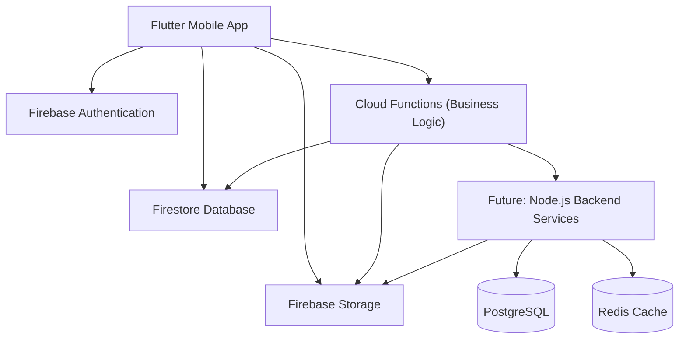
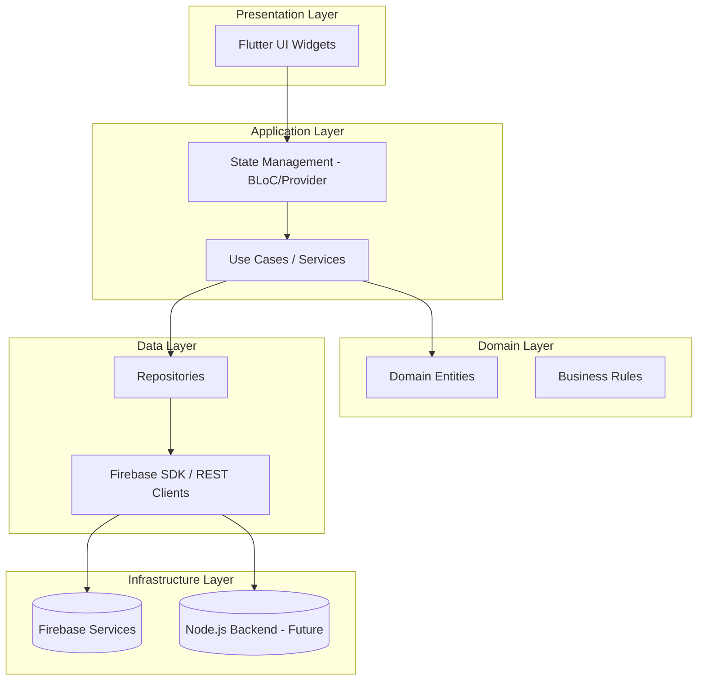
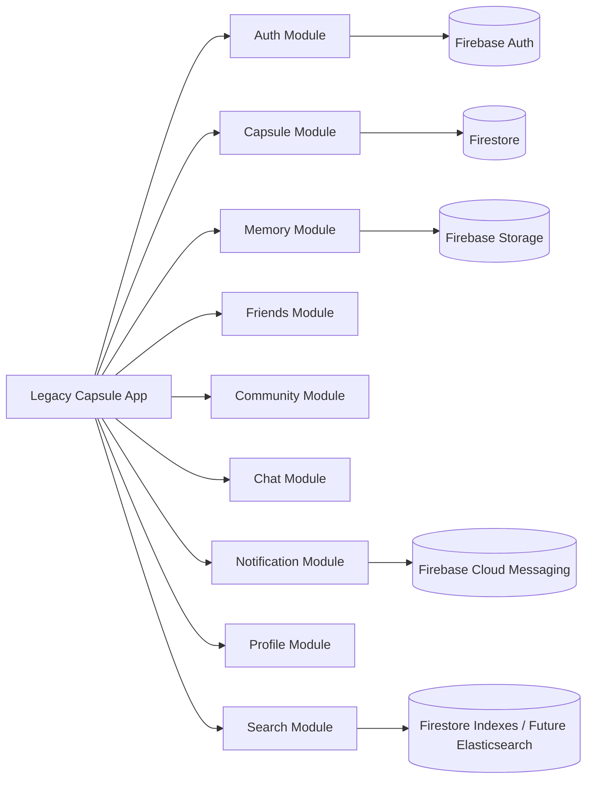
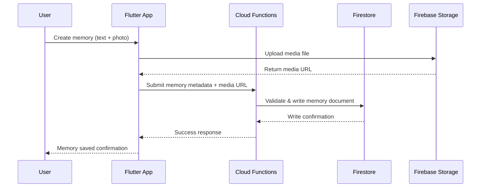
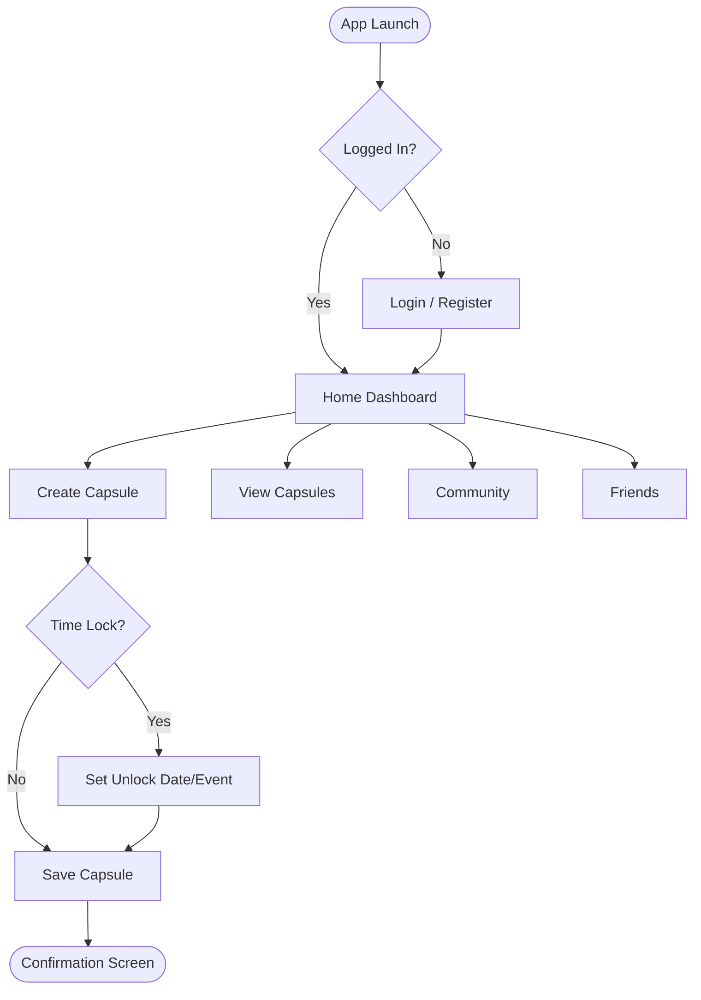
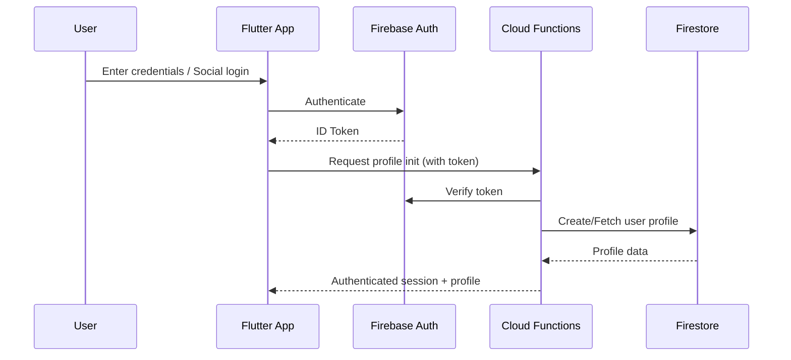
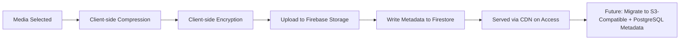
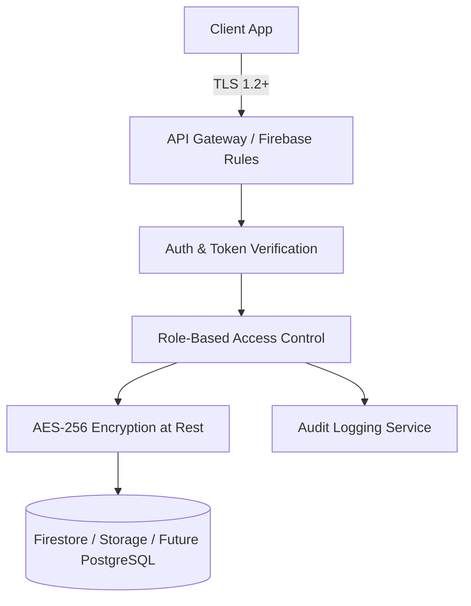
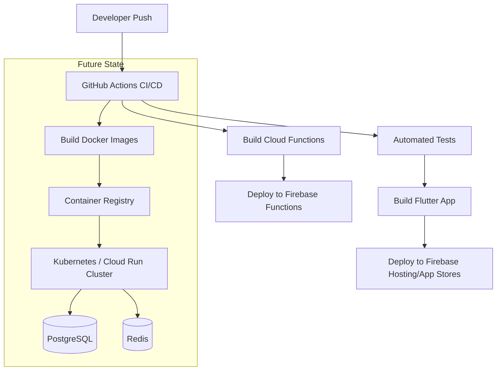
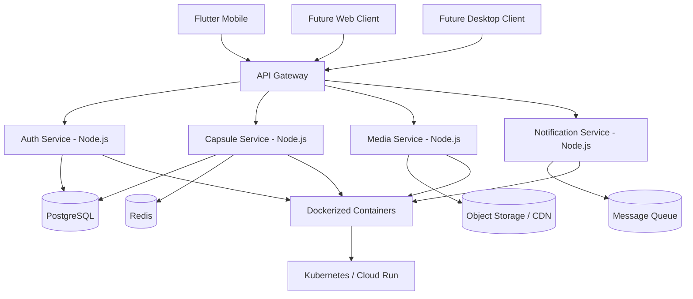

# Legacy Capsule — Architecture Documentation

## 1. High-Level Architecture

Legacy Capsule currently runs on a **Flutter + Firebase** stack, with a planned migration/extension toward a **Node.js microservices + PostgreSQL + Redis** backend as the platform scales.

## 2. Layered Architecture

## 3. Component Diagram

## 4. Data Flow

## 5. User Flow

## 6. Authentication Flow

## 7. Storage Flow

## 8. Security Architecture

Key principles:
- **Zero-trust access to time-locked content** — unlock conditions are enforced server-side, never client-side only.
- **Defense in depth** — Firebase Security Rules + Cloud Function validation + future API gateway policies.
- **Least privilege** — RBAC restricts admin/moderation actions strictly by role.

## 9. Deployment Architecture

## 10. Scalability Strategy

- **Stateless services:** All future Node.js services designed stateless for horizontal scaling behind a load balancer.
- **Caching layer:** Redis introduced for session data, hot capsule metadata, and search result caching.
- **Database partitioning:** PostgreSQL tables (memories, media) partitioned by user_id range or creation date as volume grows.
- **Media offloading:** Large media assets served via CDN, decoupled from application compute.
- **Read replicas:** PostgreSQL read replicas for search/reporting workloads separate from write-heavy transactional load.
- **Queue-based processing:** Media processing (compression, thumbnailing) offloaded to async queues (e.g., Cloud Tasks / future message broker).

## 11. Future Architecture

The future architecture transitions Legacy Capsule from a Firebase-centric BaaS model to a **containerized microservices architecture**, enabling independent scaling of authentication, capsule management, media processing, and notification services — while retaining Firebase for mobile-specific conveniences (push notifications, crash reporting) during the transition period.
