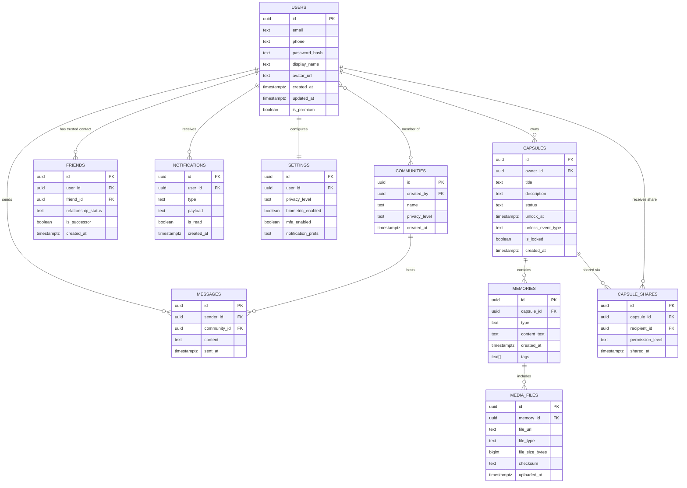

# Legacy Capsule — Database Design

Target database: **PostgreSQL 14+** (future state; current state uses Firestore collections mapped conceptually to the same entities).

## 1. Entity Descriptions

| Entity | Description |
|---|---|
| **Users** | Registered account holders; core identity and profile data. |
| **Capsules** | Containers for one or more memories; support time-lock and sharing metadata. |
| **Memories** | Individual pieces of content (text, photo, video, audio, document) inside a capsule. |
| **Friends** | Trusted-contact relationships between users, including successor designation. |
| **Communities** | Shared group spaces for collective memory preservation. |
| **Messages** | Chat messages exchanged between users or within a community. |
| **Notifications** | System-generated alerts delivered to users. |
| **MediaFiles** | Binary media asset metadata (photos, videos, audio, documents) linked to memories. |
| **Settings** | Per-user configuration (privacy, notification preferences, security options). |

## 2. ER Diagram

## 3. Relationships

| Relationship | Type | Description |
|---|---|---|
| Users → Capsules | One-to-Many | A user owns multiple capsules. |
| Capsules → Memories | One-to-Many | A capsule contains multiple memories. |
| Memories → MediaFiles | One-to-Many | A memory may include multiple media files. |
| Users → Friends | Many-to-Many (self-referencing) | Users form trusted-contact relationships with other users. |
| Users ↔ Communities | Many-to-Many | Users can join multiple communities; communities have multiple members (via join table `community_members`). |
| Communities → Messages | One-to-Many | A community hosts many chat messages. |
| Users → Notifications | One-to-Many | A user receives many notifications. |
| Users → Settings | One-to-One | Each user has exactly one settings record. |
| Capsules → CapsuleShares → Users | Many-to-Many (via join table) | Capsules can be shared with multiple recipients with distinct permissions. |

## 4. Primary Keys

All tables use a `UUID` primary key (`id`), generated via `gen_random_uuid()` (pgcrypto/pgcrypto-compatible) to avoid sequential ID enumeration and support distributed generation.

## 5. Foreign Keys

| Table | Foreign Key | References |
|---|---|---|
| capsules | owner_id | users.id |
| memories | capsule_id | capsules.id |
| media_files | memory_id | memories.id |
| friends | user_id, friend_id | users.id |
| community_members | user_id, community_id | users.id, communities.id |
| communities | created_by | users.id |
| messages | sender_id, community_id | users.id, communities.id |
| notifications | user_id | users.id |
| settings | user_id | users.id |
| capsule_shares | capsule_id, recipient_id | capsules.id, users.id |

All foreign keys use `ON DELETE CASCADE` for dependent child records (e.g., memories deleted when a capsule is deleted) except `users`, which uses `ON DELETE RESTRICT`/soft-delete to preserve referential integrity for legal and legacy purposes.

## 6. Index Strategy

| Table | Index | Purpose |
|---|---|---|
| users | UNIQUE (email) | Fast lookup, enforce uniqueness |
| capsules | (owner_id) | Fast retrieval of a user's capsules |
| capsules | (unlock_at) WHERE is_locked = true | Efficient scanning for scheduled unlock jobs |
| memories | (capsule_id) | Fast retrieval of memories per capsule |
| memories | GIN (tags) | Fast tag-based search |
| media_files | (memory_id) | Fast retrieval of media per memory |
| friends | UNIQUE (user_id, friend_id) | Prevent duplicate relationships |
| notifications | (user_id, is_read) | Fast unread-notification queries |
| capsule_shares | (recipient_id) | Fast "shared with me" queries |
| messages | (community_id, sent_at DESC) | Efficient chat pagination |

## 7. Security

- Row-Level Security (RLS) policies enforced in PostgreSQL to ensure users can only query their own capsules/memories or those explicitly shared with them.
- `password_hash` stored using Argon2id; never stored or logged in plaintext.
- Media file URLs are signed/expiring links, not permanently public.
- Time-locked capsule content columns are encrypted at the application layer using per-capsule data encryption keys (DEKs), themselves wrapped by a master key (KEK) managed via a cloud KMS.
- Audit table (`access_logs`) records every read of shared or unlocked sensitive content.

## 8. Future Scaling

- **Partitioning:** `memories` and `media_files` partitioned by `created_at` range (monthly/quarterly) once tables exceed tens of millions of rows.
- **Sharding:** User-based sharding strategy (by `user_id` hash) for horizontal scale beyond a single PostgreSQL cluster's capacity.
- **Read Replicas:** Dedicated read replicas for search, analytics, and reporting workloads.
- **Cold Storage Tiering:** Older, rarely accessed media metadata migrated to cheaper storage tiers with lifecycle policies.
- **Caching:** Redis used for hot-path reads (recent capsules, unread notification counts, session tokens).
- **Archival Compliance:** Legacy/inheritance data retained under a distinct compliance-driven retention policy, separate from standard user data lifecycle.
