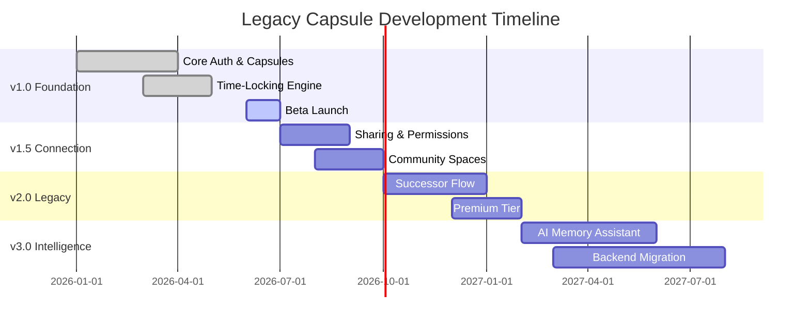

# Legacy Capsule — Product Roadmap

## Current Progress

- [x] Core account system (registration, login, social sign-in)
- [x] Basic capsule creation (text + photo)
- [x] Date-based time locking
- [x] Firebase-based storage and sync
- [ ] Voice and video memory support
- [ ] Successor/inheritance flow

## Version 1.0 — Foundation

**Theme:** Core memory preservation experience

- [x] User authentication (email, social login)
- [x] Capsule creation and management
- [x] Text and photo memories
- [x] Date-based time-locking
- [x] Basic push/email notifications
- [ ] Voice memory recording
- [ ] Friends / trusted contacts (basic)

## Version 1.5 — Connection & Sharing

**Theme:** Sharing memories with trusted people

- [ ] Trusted contact sharing permissions
- [ ] Event-triggered unlocks (birthdays, anniversaries)
- [ ] In-app notification center
- [ ] Multi-language localization
- [ ] Biometric app lock
- [ ] Basic community spaces

## Version 2.0 — Legacy & Security

**Theme:** Long-term trust and inheritance

- [ ] Successor designation and verified inheritance flow
- [ ] Multi-factor authentication (TOTP)
- [ ] Access logs and audit trail
- [ ] Legacy collections (curated multi-capsule archives)
- [ ] Premium subscription tier launch
- [ ] Chat/messaging between trusted contacts

## Version 3.0 — Intelligence & Expansion

**Theme:** AI-assisted preservation and platform growth

- [ ] AI Memory Assistant (auto-tagging, summarization)
- [ ] Family legacy tree
- [ ] Web and desktop clients
- [ ] Migration to Node.js microservices + PostgreSQL backend
- [ ] Zero-knowledge encrypted capsule option
- [ ] Enterprise/organizational legacy programs

## Milestones

| Milestone | Target Phase |
|---|---|
| Public Beta Launch | End of v1.0 |
| 100K Registered Users | During v1.5 |
| Premium Tier Revenue Positive | During v2.0 |
| Backend Microservices Migration Complete | Start of v3.0 |
| 1M Registered Users | During v3.0 |

## Development Timeline

## Completed Features

- [x] Account registration and authentication
- [x] Basic capsule creation and storage
- [x] Text and photo memory support
- [x] Date-based time-lock mechanism
- [x] Push and email notifications (basic)

## Current Sprint

- [ ] Voice memory recording and playback
- [ ] Trusted contact invitation flow
- [ ] Biometric lock implementation
- [ ] In-app notification center UI

## Future Features

- [ ] Event-triggered capsule unlocks
- [ ] Successor/inheritance verification workflow
- [ ] Community moderation tools
- [ ] Legacy collections
- [ ] Web client (Flutter Web or dedicated stack)

## Stretch Goals

- [ ] VR memory experience for immersive capsule reveals
- [ ] Blockchain-based authenticity verification for historical archives
- [ ] AI-generated guided legacy letter prompts
- [ ] Cross-platform desktop application

## Long-Term Vision

Legacy Capsule aims to become the definitive platform for digital memory and legacy preservation — expanding from an individual/family tool into a broader **Digital Heritage ecosystem** spanning personal, community, and institutional memory preservation, underpinned by best-in-class privacy and security practices. See `future-plans.md` for the detailed five-year vision.
