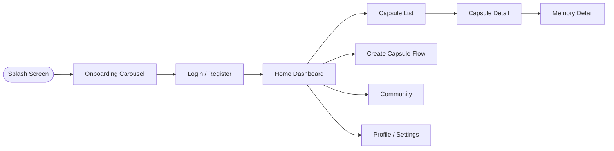

# Legacy Capsule — UI/UX Design Documentation

## 1. Design Language

Legacy Capsule's design language is **warm, calm, and trustworthy** — evoking the feeling of a keepsake box rather than a social feed. The visual system follows **Material 3 (Material You)** principles, adapted with a softer, more emotionally resonant tone appropriate for legacy and memory content.

Design pillars:
- **Calm over stimulating** — no aggressive engagement patterns, no infinite scroll gamification.
- **Warmth over sterility** — organic shapes, soft shadows, and gentle motion.
- **Clarity over density** — generous whitespace, one primary action per screen.

## 2. Color Palette

| Role | Color | Hex | Usage |
|---|---|---|---|
| Primary | Deep Amber | `#B4762F` | Primary buttons, key actions |
| Primary Container | Soft Amber | `#F4E3C8` | Highlighted cards, selected states |
| Secondary | Muted Teal | `#3F6C64` | Secondary actions, accents |
| Background (Light) | Warm Ivory | `#FBF7F0` | Default light background |
| Background (Dark) | Deep Charcoal | `#1C1B19` | Default dark background |
| Surface | Off-White | `#F1ECE3` | Cards, sheets |
| Error | Muted Rust | `#B3261E` | Errors, destructive actions |
| Success | Sage Green | `#4C7A5B` | Confirmations, unlock success |
| Text Primary | Near-Black | `#26221D` | Primary text (light mode) |
| Text Secondary | Warm Gray | `#6E6558` | Secondary/supporting text |

## 3. Typography

| Style | Font | Size | Weight | Usage |
|---|---|---|---|---|
| Display Large | Source Serif 4 | 34px | 600 | Onboarding, capsule reveal moments |
| Headline | Inter | 24px | 600 | Screen titles |
| Title | Inter | 18px | 500 | Section headers |
| Body | Inter | 15px | 400 | Standard body text |
| Label | Inter | 13px | 500 | Buttons, tags, chips |
| Caption | Inter | 12px | 400 | Timestamps, metadata |

A serif display font is used deliberately for emotionally significant moments (e.g., capsule unlock reveals) to create a distinct, memorable tone versus routine UI text.

## 4. Spacing

Base unit: **4px grid system**.

| Token | Value | Usage |
|---|---|---|
| `space-xs` | 4px | Icon-to-label gaps |
| `space-sm` | 8px | Compact element spacing |
| `space-md` | 16px | Standard component padding |
| `space-lg` | 24px | Section spacing |
| `space-xl` | 32px | Screen-level margins |
| `space-2xl` | 48px | Hero/onboarding spacing |

## 5. Components

| Component | Description |
|---|---|
| Capsule Card | Rounded card (16px radius) showing capsule title, lock status icon, and unlock countdown. |
| Memory Tile | Grid/list item representing a single memory with type icon (text/photo/video/audio). |
| Lock Badge | Pill-shaped badge indicating "Locked until [date]" or "Unlocked". |
| Primary Button | Filled, rounded (24px radius), amber background, used for one key action per screen. |
| Bottom Sheet | Used for capsule creation flow, sharing options, and confirmations. |
| Timeline Component | Vertical timeline visualizing memories chronologically. |
| Avatar Stack | Overlapping avatars showing recipients/collaborators on a shared capsule. |

## 6. Navigation

- **Bottom navigation bar** (mobile) with 4 primary destinations: Home, Capsules, Community, Profile.
- **Floating action button** for "Create Memory" accessible from Home and Capsules.
- **Nested navigation** for capsule detail → memory detail, using standard push transitions.
- Future **Web/Desktop** navigation uses a persistent left rail instead of bottom navigation, per Material 3 adaptive layout guidance.

## 7. Animations

- **Capsule unlock reveal:** a signature animation (gentle unlock/opening motion, 600–800ms) reinforces the emotional significance of the moment.
- **Micro-interactions:** subtle scale/opacity transitions (150–200ms) on button presses and card taps.
- **Reduced motion mode:** all signature animations have a reduced-motion fallback (simple fade) respecting system accessibility settings.

## 8. Dark Mode

- Full Material 3 dynamic color support for both light and dark themes.
- Dark mode uses deep charcoal backgrounds (not pure black) to reduce harsh contrast and preserve the platform's warm tone.
- All color tokens defined as semantic roles (not hardcoded hex) to support automatic theme switching.

## 9. Accessibility

- Minimum contrast ratio of 4.5:1 for body text (WCAG 2.1 AA).
- All interactive elements have a minimum 48x48dp touch target.
- Full screen-reader support (semantic labels on all icons and custom components).
- Reduced-motion and high-contrast modes supported system-wide.
- Text scaling supported up to 200% without layout breakage.

## 10. Responsive Design

| Breakpoint | Target | Layout Behavior |
|---|---|---|
| < 600dp | Mobile phones | Single-column, bottom navigation |
| 600–840dp | Tablets (portrait) | Two-pane list/detail layout |
| 840–1200dp | Tablets (landscape) / small desktop | Persistent navigation rail |
| > 1200dp | Desktop/Web (future) | Three-pane layout with expanded detail view |

## 11. Screen Flow

## 12. User Journey

1. **Discovery** — user learns about Legacy Capsule through word-of-mouth or app store.
2. **Onboarding** — brief, emotionally framed onboarding (3 screens) explaining capsules and time-locking.
3. **First Capsule** — guided creation of a first memory within the first session (activation moment).
4. **Habitual Use** — periodic addition of memories, tagging, and organizing into collections.
5. **Trust Building** — user adds trusted contacts, explores sharing and security settings.
6. **Legacy Planning** — user designates a successor and configures inheritance conditions.
7. **Long-Term Value** — user or recipient experiences a capsule unlock moment — the platform's core emotional payoff.

## 13. Wireframe Description

- **Home Dashboard:** Greeting header, "Create Memory" FAB, horizontally scrolling "Upcoming Unlocks" row, vertical feed of recent capsules.
- **Capsule Detail:** Hero header with capsule title and lock badge, vertical timeline of contained memories, share/action bar at bottom.
- **Create Capsule Flow (bottom sheet, multi-step):** Step 1 — choose memory type; Step 2 — add content; Step 3 — set lock/sharing options; Step 4 — review & confirm.
- **Community Screen:** Tab bar (Feed / Members / Chat), card-based feed of shared community memories.
- **Profile/Settings:** Sectioned list — Account, Security & Privacy, Trusted Contacts & Successors, Notifications, About.

## 14. Material 3 Guidelines

- Uses **dynamic color** theming derived from a seed color, generating tonal palettes for light/dark modes automatically.
- Adopts Material 3 **shape system** (rounded corners scaled by component size/importance).
- Uses Material 3 **elevation via tonal color** rather than heavy drop shadows, consistent with the platform's calm aesthetic.
- Adaptive layouts follow Material 3 **window size class** guidance (compact / medium / expanded) for phone, tablet, and future desktop targets.
